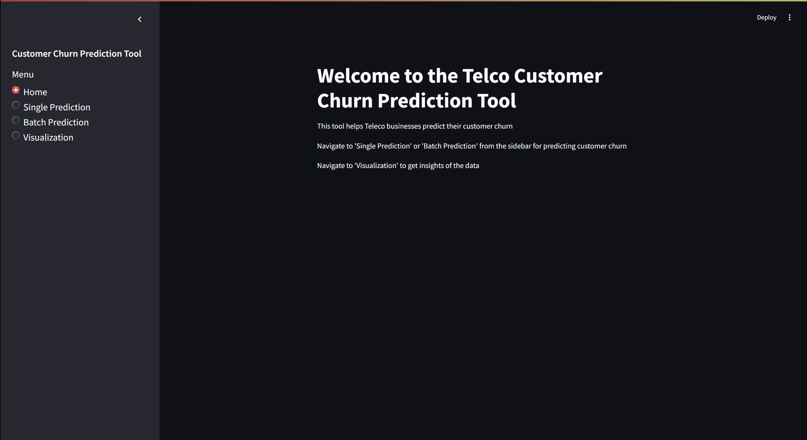
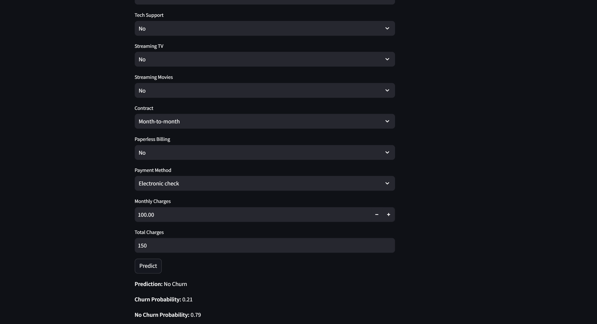
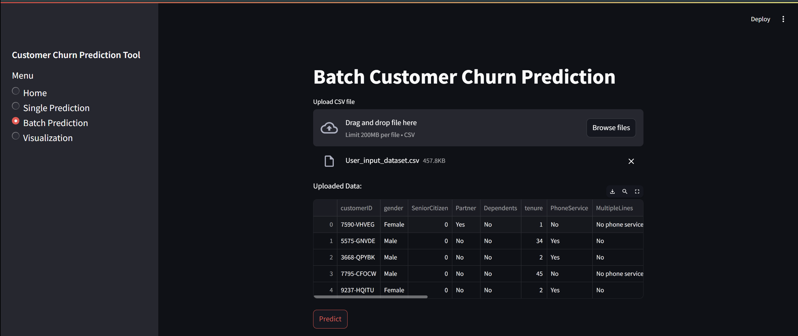
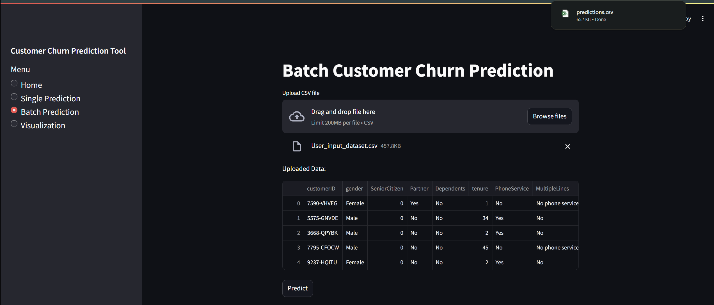
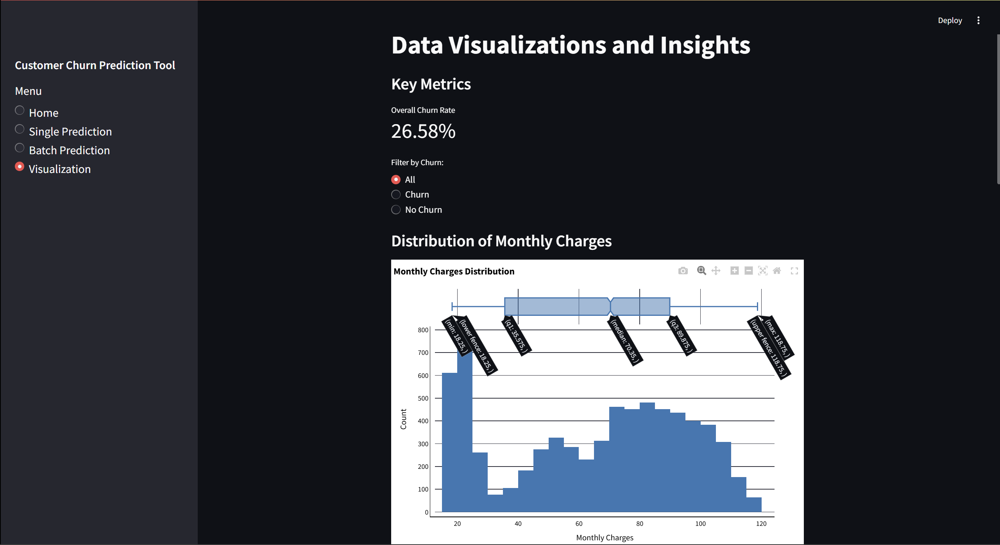
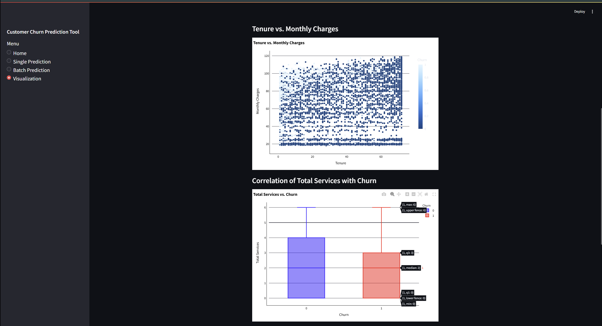
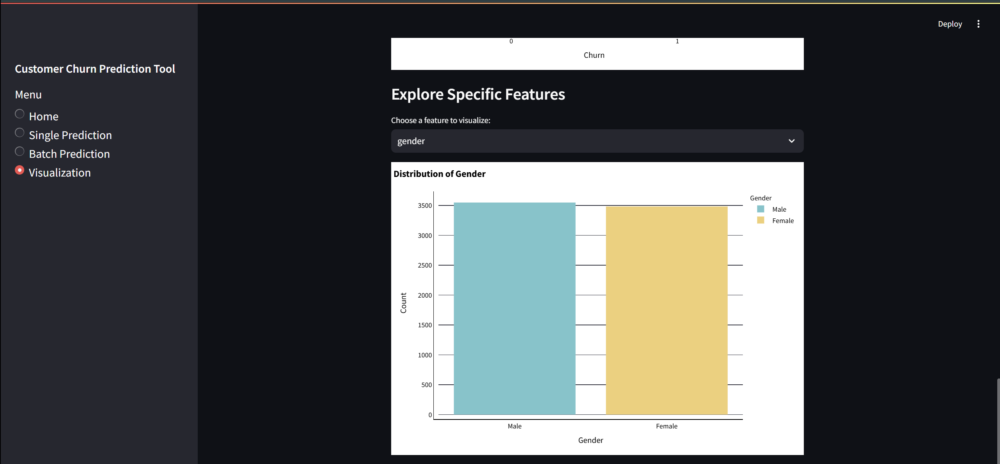

# Telco Customer Churn Prediction Tool



## Overview

Welcome to our **Telco Customer Churn Prediction Tool**, the ultimate solution for personalized churn prediction in the telecommunications industry. This interactive web app leverages data preprocessing, exploratory analysis, and machine learning to predict whether a customer is likely to churn. It provides both single and batch prediction functionalities along with insightful visualizations to help improve customer retention strategies.

## Table of Contents

- [Overview](#overview)
- [Project Structure](#project-structure)
- [Installation](#installation)
- [Usage](#usage)
  - [Data Preprocessing & Model Exploration](#data-preprocessing--model-exploration)
  - [Interactive Prediction with Streamlit](#interactive-prediction-with-streamlit)
- [Methodology](#methodology)
- [Key Technologies](#key-technologies)
- [Screenshots](#screenshots)
- [Contact](#contact)

## Project Structure
```
customer-churn-analysis/
├── data/
│   ├── preprocessed_customer_churn_.csv
│   └── encoded_customer_churn_.csv
├── models/
│   ├── logistic_regression_model.pkl      # Trained model artifact
│   └── scaler.pkl                         # Fitted scaler for preprocessing
├── notebook/
│   └── churn_analysis.ipynb               # Jupyter Notebook for EDA, preprocessing, and modeling
├── Customer Churn Prediction Tool.py      # Streamlit application for interactive predictions and visualizations
├── requirements.txt      # Dependencies list
├── .gitignore            # Files and folders to ignore
└── README.md             # Project documentation
```

## Installation

1. **Clone the repository:**

   ```
   git clone https://github.com/PatilPrajakta14/Customer-Churn-Analysis-Prediction.git
   ```
   
2. Install dependencies:
```
pip install -r requirements.txt
```

### Usage

#### Data Preprocessing & Model Exploration

Our Jupyter Notebook (`churn_analysis.ipynb`) contains detailed steps on:

- **Data Preprocessing**:
  - Cleaning and handling missing values.
  - Encoding categorical variables using One-Hot Encoding.
  - Scaling numerical features with `StandardScaler` (saved as `scaler.pkl`).
  - Feature engineering, such as creating additional features like `TotalServices` and `AvgMonthlyCharges`.

- **Exploratory Data Analysis (EDA)**:
  - Visualizations including histograms, box plots, scatter plots, and correlation heatmaps.
  - Insights into customer behavior and factors influencing churn.

- **Predictive Modeling**:
  - Implementation and evaluation of models like KNN, Logistic Regression, Decision Tree, Random Forest, SVM, and Gradient Boosting.
  - Hyperparameter tuning using `GridSearchCV` and `RandomizedSearchCV`.
  - Achieving the highest accuracy with **Logistic Regression (79.76%)**.

---

## Interactive Prediction with Streamlit

The **Streamlit app** (`Customer Churn Prediction Tool.py`) offers:

1. **Single Prediction**:
   - Enter customer details (e.g., gender, tenure, monthly charges etc) and click **Predict** to receive a churn prediction with probability scores.

2. **Batch Prediction**:
   - Upload a CSV file containing multiple customer records.
   - Preview the top 5 rows and click **Predict** to get churn predictions for each record.
   - Download the predictions as a CSV file.

3. **Visualization**:
   - Interactive charts displaying overall churn rate, distribution of monthly charges, tenure vs. monthly charges, and the correlation of total services with churn.
   - Filter data based on churn status for detailed analysis.

Launch the app with:
```
streamlit run app.py

```

## Methodology

### Data Preprocessing
- **Cleaning & Encoding**:  
  Handling missing values, encoding categorical variables, and normalizing numerical features.
- **Scaling**:  
  Standardizing features using `StandardScaler` to ensure consistency during training and predictions.
- **Feature Engineering**:  
  Creating new features (e.g., `TotalServices`, `AvgMonthlyCharges`) to better capture customer behavior.

### Exploratory Data Analysis (EDA)
- **Visualization Techniques**:  
  Histograms, box plots, scatter plots, and heatmaps to explore data distributions and trends.
- **Insights**:  
  Identification of key factors such as monthly charges and tenure that influence churn.

### Predictive Modeling
- **Model Development**:  
  Tested multiple ML models with hyperparameter tuning.
- **Final Model**:  
  Integrated Logistic Regression into the Streamlit app, achieving **79.76% accuracy**.

---

## Key Technologies
- **Programming Language**: Python  
- **Data Processing**: Pandas, NumPy  
- **Visualization**: Matplotlib, Seaborn, Plotly  
- **Machine Learning**: Scikit-learn (KNN, Logistic Regression, Decision Tree, Random Forest, SVM, Gradient Boosting)  
- **Web Application**: Streamlit  
- **Model Serialization**: Pickle
  

## Screenshots

**Home Page**  


---

**Single Customer Prediction**  
- **Input Form:**  
  
- **Prediction Result:**  
  

---

**Batch Prediction**  
- **Upload Interface:**  
  
- **Prediction Output & Download:**  
  

---

**Visualizations**  
- **Distribution of Monthly Charges:**  
  
- **Tenure vs. Monthly Charges:**  
  
- **Correlation of Total Services with Churn:**  
  

## Contact
Team Members:

- Prajakta Patil
- Sweta Sahu
- Sruthisri Venkateswaran

For any questions or feedback, please contact us at pprajakta1406@gmail.com

Thank you for exploring our Telco Customer Churn Prediction Tool. If you find this project useful, please consider starring the repository on GitHub!
